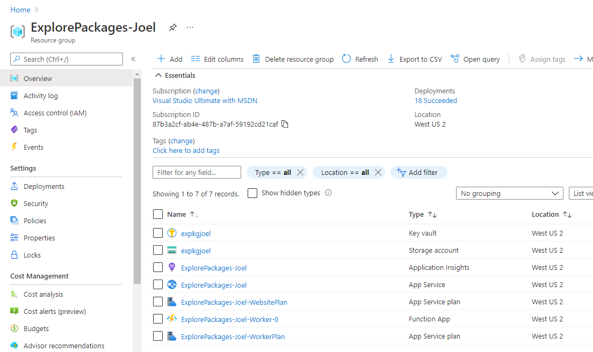

# ExplorePackages [](https://github.com/joelverhagen/ExplorePackages/actions/workflows/build.yml)

Analyze packages NuGet.org in a highly distributed manner. Or, if you want a sales pitch:

> Process all of NuGet.org in less than an hour for less than $10.*

(*depending on what you want to know 😅)

## Quickstart

**We follow a 3 step process to go from nothing to a completely deployed Azure solution.**

1. Build the code
3. Deploy to Azure
4. Start analysis from the admin panel

### Build the code

1. Ensure you have the .NET 3.1 and 5 SDK installed. [Install it if needed](https://dotnet.microsoft.com/download).
   ```
   dotnet --info
   ```
2. Clone the repository.
   ```
   git clone https://github.com/joelverhagen/ExplorePackages.git
   ```
3. Run `dotnet publish` on the website and worker projects. This produces compiled directories that can be deployed to Azure later.
   ```
   cd ExplorePackages
   dotnet publish src/Worker -c Release
   dotnet publish src/Website -c Release
   ```

### Deploy to Azure

PowerShell is used for the following steps. I have tested Windows PowerShell 5.1, Windows PowerShell 7.1.3, and Linux PowerShell 7.1.3.

1. Ensure you have the Az PowerShell modules. [Install them if needed](https://docs.microsoft.com/en-us/powershell/azure/install-az-ps).
   ```powershell
   Connect-AzAccount
   ```
1. Ensure you have Bicep installed. [Install it if needed](https://github.com/Azure/bicep/blob/main/docs/installing.md).
   ```
   bicep --version
   ```
1. Ensure you have the desired Azure subscription selected.
   ```powershell
   Set-AzContext -Subscription $mySubscriptionId
   ```
1. From the root of the repo, deploy with the desired [config](deploy/config) and stack name.
   ```powershell
   ./deploy/deploy.ps1 -ConfigName dev -StackName Joel -AllowDeployUser
   ```
   If you run into trouble, try adding the `-Debug` option to get more diagnostic information.

This will create a new resource group with name `ExplorePackages-{StackName}` deploy several resources into it including:
- an App Service, containing a website for starting scans
- a Function App with Consumption plan, for running the scans
- a Storage account, for maintaining intermediate state and results (CSV files)
- an Application Insights instance, for investigating metrics and error logs
- a Key Vault for storing storage keys and SAS definitions

### Start analysis from the admin panel

When the deployment completes successfully, a "website URL" will be reporting in the console as part of a warm-up. You
can use this to access the admin panel. The end of the output

<pre>
...
Warming up the website and workers...
<b>https://explorepackages-joel.azurewebsites.net/</b> - 200 OK
https://explorepackages-joel-worker-0.azurewebsites.net/ - 200 OK
</pre>

You can go the first URL which is the website URL. in your web browser click on the **Admin** link in the nav bar. Then, you can start 
a short run using the "All catalog scans" section, "Use custom max" checkbox, and "Start all" button.

You're ready to go!

## Running locally

To run locally, all you need is [Azure Storage Emulator](https://docs.microsoft.com/en-us/azure/storage/common/storage-use-emulator).
Note that you cannot use Azurite since the latest version of it does not support Azure Table Storage.

1. Clone the repository.
2. Open the solution in Visual Studio (ExplorePackages.sln).
3. Make sure the Azure Storage Emulator is running.
4. Press F5 to launch the website (the Website project). It's the default startup project.
5. Click on the "Admin" link in the navigation bar.
6. Start some catalog scans.
   - You can start all of the catalog scans with the same timestamp using the "All catalog scans" section.
   - When starting out, use a custom max timestamp like `2015-02-01T06:22:45.8488496Z`.
   - This timestamp is the first commit to the catalog and will run quickly, only processing 20 packages.
7. Stop the website.
8. Start the function app (the Worker project).
9. Wait until the catalog scan is done.
   - This can be seen by looking at the `workerqueue` queue or by looking at the admin panel seen above.

## Screenshots

### Resources in Azure

These are what the resources look like in Azure after deployment.



### Azure Function running locally

This is what the Azure Function looks like running locally, for the Package Manifest to CSV driver.


### Results running locally

This is what the results look like in Azure Table Storage. Each row is a package .nuspec stored as compressed
MessagePack bytes.


### Admin panel

This is what the admin panel looks like to start catalog scans.


### Load Package Archive

This is the driver that reads the file list and package signature from all NuGet packages on NuGet.org and loads them
into Azure Table Storage. It took about 35 minutes to do this and costed about $3.37.

#### Azure Functions Execution Count


#### Azure Functions Execution Count


## Architecture

The purpose of this repository is to explore the characteristics, oddities, and inconsistencies of NuGet.org's available
packages.

Fundamentally, the project uses the [NuGet.org catalog](https://docs.microsoft.com/en-us/nuget/api/catalog-resource) to
enumerate all package IDs and versions. For each ID and version, some unit of work is performed. This unit of work can
be some custom analysis that you want to do on a package. There are some helper classes to write the results out to big
CSVs for importing into Kusto or the like but in general, you can do whatever you want per package.

The custom logic to run on a per-package (or per catalog leaf/page) is referred to as a **"driver"**.

The enumeration of the catalog is called a "catalog scan". The catalog scan is within a specified time range in the
catalog, with respect to the catalog commit timestamp. A catalog scan finds all catalog leaves in the provided min and
max commit timestamp and then executes a "driver" for each package ID and version found.

All work is executed in the context of an Azure Function that reads a single worker queue (Azure Storage Queue).

The general flow of a catalog scan is:

1. Download the catalog index.
1. Find all catalog pages in the time range.
1. For each page, enumerate all leaf items per page in the time range.
1. For each leaf item, write the ID and version to Azure Table Storage to find the latest leaf.
1. After all leaf items have been written to Table Storage, enqueue one message per row.
1. For each queue message, execute the driver.

Note there is an option to disable step 4 and run the driver for every single catalog leaf item. Depending on the logic
of the driver, this may yield duplicated effort and is often not desired.

The implementation is geared towards Azure Functions Consumption Plan for compute (cheap) and Azure Storage for
persistence (cheap).

## Projects

Here's a high-level description of main projects in this repository:

- [`Worker`](src/Worker) - the Azure Function itself, a thin adapter between core logic and Azure Functions
- [`Website`](src/Website) - a website for checking [consistency](docs/consistency.md) and an admin panel for starting scans
- [`Worker.Logic`](src/Worker.Logic) - all of the catalog scan and driver logic, this is the most interesting project
- [`Logic`](src/Logic) - contains more generic logic related to NuGet.org protocol and is not directly related to distributed processing

Other projects are:

- [`SourceGenerator`](src/SourceGenerator) - AOT source generation logic for reading and writing CSVs
- [`Tool`](src/Tool) - a command-line app used for pretty much just prototyping code

## Drivers

The current drivers for analyzing NuGet.org packages are:

- [`CatalogLeafItemToCsv`](src/Worker.Logic/CatalogScan/Drivers/CatalogLeafItemToCsv/CatalogLeafItemToCsvDriver.cs) - write all catalog leaf items to big CSVs for analysis
- [`PackageArchiveToCsv`](src/Worker.Logic/CatalogScan/Drivers/PackageArchiveToCsv/PackageArchiveToCsvDriver.cs) - find info about all ZIP entries in the .nupkg
- [`PackageAssemblyToCsv`](src/Worker.Logic/CatalogScan/Drivers/PackageAssemblyToCsv/PackageAssemblyToCsvDriver.cs) - find stuff like public key tokens in assemblies using `System.Reflection.Metadata`
- [`PackageAssetToCsv`](src/Worker.Logic/CatalogScan/Drivers/PackageAssetToCsv/PackageAssetToCsvDriver.cs) - find assets recognized by NuGet restore
- [`PackageManifestToCsv`](src/Worker.Logic/CatalogScan/Drivers/PackageManifestToCsv/PackageManifestToCsvDriver.cs) - extract known data from the .nuspec
- [`PackageSignatureToCsv`](src/Worker.Logic/CatalogScan/Drivers/PackageSignatureToCsv/PackageSignatureToCsvDriver.cs) - parse the NuGet package signature
- [`PackageVersionToCsv`](src/Worker.Logic/CatalogScan/Drivers/PackageVersionToCsv/PackageVersionToCsvDriver.cs) - determine latest version per package ID

Several other supporting drivers exist to populate storage with intermediate results:

- [`BuildVersionSet`](src/Worker.Logic/CatalogScan/Drivers/BuildVersionSet/BuildVersionSetDriver.cs) - serializes all IDs and versions into a `Dictionary`, useful for fast checks
- [`LoadLatestPackageLeaf`](src/Worker.Logic/CatalogScan/Drivers/LoadLatestPackageLeaf) - write the latest catalog leaf to Table Storage
- [`LoadPackageArchive`](src/Worker.Logic/CatalogScan/Drivers/LoadPackageArchive/LoadPackageArchiveDriver.cs) - fetch information from the .nupkg and put it in Table Storage
- [`LoadPackageManifest`](src/Worker.Logic/CatalogScan/Drivers/LoadPackageManifest/LoadPackageManifestDriver.cs) - fetch the .nuspec and put it in Table Storage
- [`LoadPackageVersion`](src/Worker.Logic/CatalogScan/Drivers/LoadPackageVersion/LoadPackageVersionDriver.cs) - determine listed and SemVer status and put it in Table Storage

Several message processors exist to emit other useful data:

- [`DownloadsToCsv`](src/Worker.Logic/MessageProcessors/DownloadsToCsv/DownloadsToCsvUpdater.cs) - read `downloads.v1.json` and write it to CSV
- [`OwnersToCsv`](src/Worker.Logic/MessageProcessors/OwnersToCsv/OwnersToCsvUpdater.cs) - read `owners.v2.json` and write it to CSV

## Other docs

- **[Adding a new driver](docs/new-driver.md) - a guide to help you enhance ExplorePackages to suit your needs.**
- [Blog posts](docs/blog-posts.md) - blog posts about lessons learned from this project
- [Consistency](docs/consistency.md) - a consistency checker for packages published to NuGet.org
- [Cost](docs/cost.md) - how much it costs to run several of the implemented catalog scans
- [Notable classes](docs/notable-classes.md) - interesting or useful classes supporting this project
