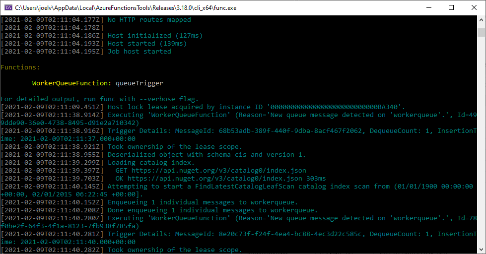
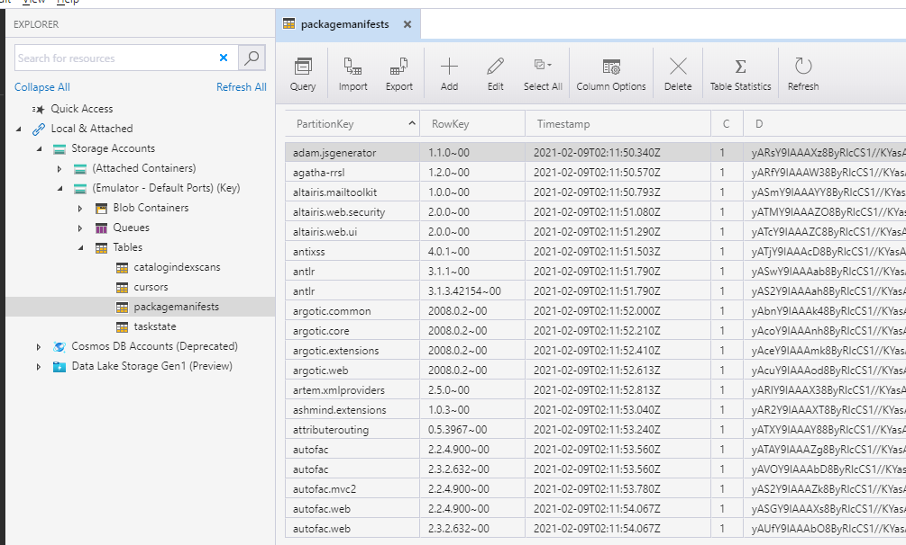
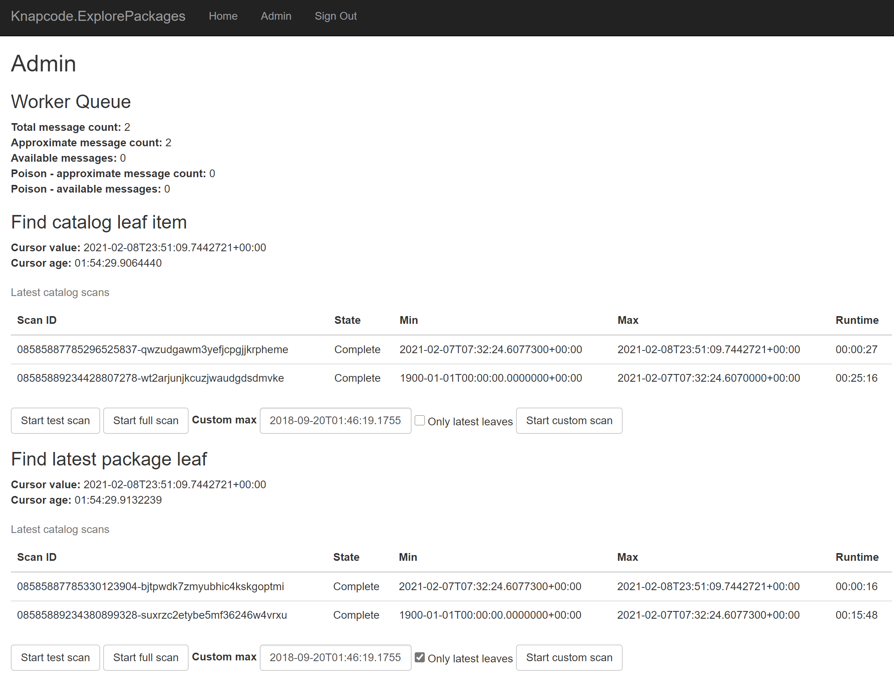
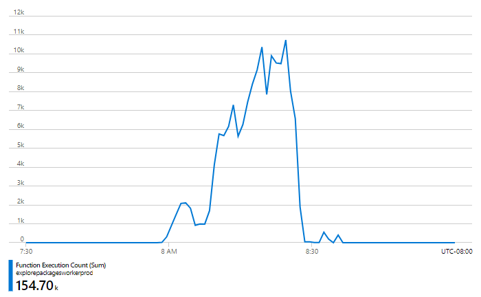
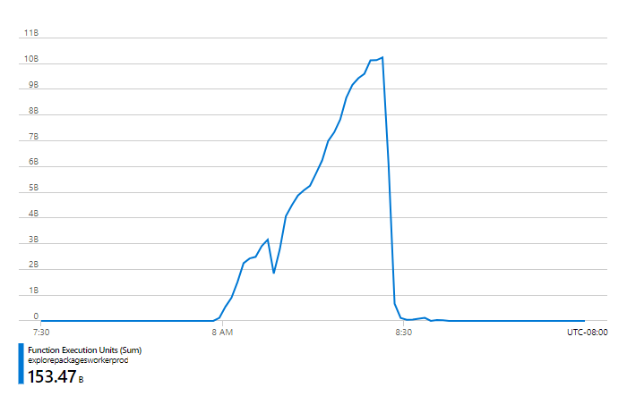
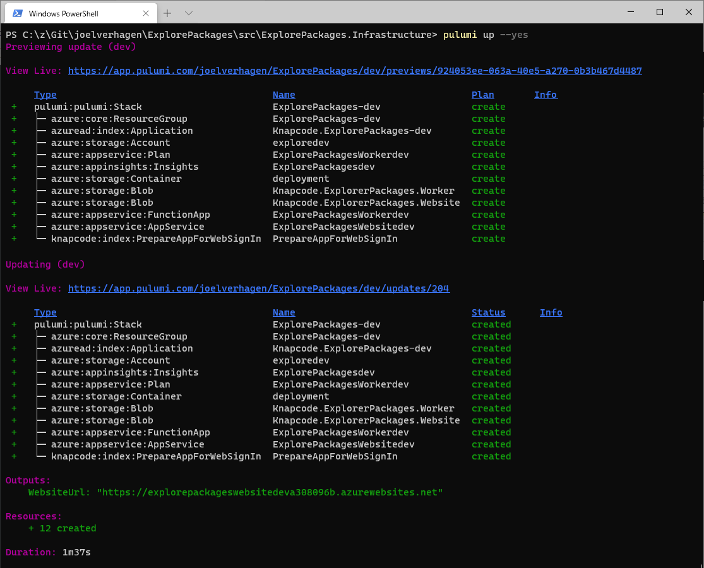

# ExplorePackages [](https://github.com/joelverhagen/ExplorePackages/actions/workflows/build.yml)

Analyze packages NuGet.org in a highly distributed manner. Or, if you want a sales pitch:

> Process all of NuGet.org in less than an hour for less than $10.*

(*depending on what you want to know 😅)

## Quickstart

We follow a 4 step process to go from nothing to a completely deployed Azure solution.

1. Build the code
2. Set up Pulumi (an "infrastructure as code" solution)
3. Deploy to Azure
4. Start analysis from the admin panel

### Build the code

1. Ensure you have the .NET 5 SDK installed. [Install it](https://dotnet.microsoft.com/download) if needed.
   ```
   dotnet --info
   ```
2. Clone the repository.
   ```
   git clone https://github.com/joelverhagen/ExplorePackages.git
   ```
3. Run `dotnet publish` on the website and worker projects. This produces a directory that can be uploaded to Azure later.
   ```
   cd ExplorePackages
   dotnet publish src/ExplorePackages.Worker -c Release
   dotnet publish src/ExplorePackages.Website -c Release
   ```

### Set up Pulumi

I use Pulumi to orchestrate the deployment of my code to Azure. This simplifies the dependencies between various
Azure resources. It is not a Microsoft product but calls into Azure management APIs for provisioning resources and
uploaded code to run.

It is an "infrastructure as code" solution that is similar to [Bicep](https://github.com/Azure/bicep) and perhaps 
"higher level" than Azure ARM templates. In short, I have
[C# code that expresses the shape of my desired Azure resources](src/ExplorePackages.Infrastructure/MyStack.cs#) and
Pulumi performs the Azure commands necessary to bring those resources into being.

Follow the documentation on Pulumi's website to install Pulumi and configure it for Azure:
[**Install Pulumi and configure it for Azure**](https://www.pulumi.com/docs/get-started/azure/).

### Deploy to Azure

1. Go to the infrastructure directory where the Azure resources are defined.
   ```
   cd src/ExplorePackages.Infrastructure
   ```
1. Select a "stack" (or make a new one). A stack is an individual instance of the deployment. A common use for stacks is
   a clear separation between a "dev" or "pre-PROD" environment and your main "PROD" environment. **Note:** the admin
   panel web page is open to anyone that has the URL (no authentication) by default. This should be secured by using
   the `AllowedUsers` configuration like in [my PROD stack](src/ExplorePackages.Infrastructure/Pulumi.prod.yaml).
   ```
   pulumi stack select dev
   ```
1. Preview the deployment and confirm the deployment interactively by selecting "yes" in the Pulumi prompt.
   ```
   pulumi up
   ```

This will deploy several resources including:
- an App Service, for starting scans
- a Function App with Consumption plan, for running the scans
- a Storage account, for maintaining state
- an Application Insights instance, for investigating metrics and error logs

### Start analysis from the admin panel

When the deployment completes successfully, an 

## Deploying to Azure

If you want to deploy this to Azure:

1. [Install Pulumi and configure it for Azure](https://www.pulumi.com/docs/get-started/azure/).
1. Install my Pulumi plug-in for workaround around some problems ([context](https://github.com/joelverhagen/pulumi-knapcode#full-explanation)).
   ```
   pulumi plugin install resource knapcode v0.0.1 --server https://github.com/joelverhagen/pulumi-knapcode/releases/download/v0.0.1
   ```
1. Go to the infrastructure directory.
   ```
   cd src/ExplorePackages.Infrastructure
   ```
1. Select a stack (or make a new one). Feel free to clear out my default `AllowedUsers` config.
   ```
   pulumi stack select dev
   ```
1. Publish the worker and website.
   ```
   dotnet publish ../ExplorePackages.Worker -c Release
   dotnet publish ../ExplorePackages.Website -c Release
   ```
1. Deploy!
   ```
   pulumi up
   ```

You will need to update the configuration with your hashed tenant ID and object ID claims to gain access to the admin
panel. The "access denied" page of the admin panel will list all of your claims so you can grab the values there then
bake them into your Pulumi stack's YAML config file for subsequent deployments.

## Running locally

To run locally, all you need is [Azure Storage Emulator](https://docs.microsoft.com/en-us/azure/storage/common/storage-use-emulator).
Note that you cannot use Azurite since the latest version of it does not support Azure Table Storage.

1. Clone the repository.
2. Open the solution in Visual Studio (ExplorePackages.sln).
3. Make sure the Azure Storage Emulator is running.
4. Press F5 to launch the website (ExplorePackages.Website). It's the default startup project.
5. Click on the "Admin" link in the navigation bar.
6. Start one of the catalog scans, e.g. Find Package Manifest.
   - When starting out, use a custom max timestamp like `2015-02-01T06:22:45.8488496Z` and click "Start Custom Scan".
   - This timestamp is the first commit to the catalog and will run quickly, only processing 20 packages.
   - Pressing "Start Full Scan" will process the entire catalog and will take a very long time locally.
7. Stop the website.
8. Start the function app (ExplorePackages.Worker).
9. Wait until the catalog scan is done.
   - This can be seen by looking at the `workerqueue` queue or by looking at the admin panel seen above.

## Screenshots

### Azure Function running locally

This is what the Azure Function looks like running locally, for the Find Package Manifest driver.



### Results running locally

This is what the results look like in Azure Table Storage. Each row is a package .nuspec stored as compressed
MessagePack bytes.



### Admin panel

This is what the admin panel looks like to start catalog scans.



### Find Package File

This is the driver that reads the file list and package signature from all NuGet packages on NuGet.org and loads them
into Azure Table Storage. It took about 35 minutes to do this and costed about $3.37.

#### Azure Functions Execution Count



#### Azure Functions Execution Count



#### Deploying to Azure using Pulumi



## Architecture

The purpose of this repository is to explore the characteristics, oddities, and inconsistencies of NuGet.org's available
packages.

Fundamentally, the project uses the [NuGet.org catalog](https://docs.microsoft.com/en-us/nuget/api/catalog-resource) to
enumerate all package IDs and versions. For each ID and version, some unit of work is performed. This unit of work can
be some custom analysis that you want to do on a package. There are some helper classes to write the results out to big
CSVs for importing into Kusto or the like but in general, you can do whatever you want per package.

The custom logic to run on a per-package (or per catalog leaf/page) is referred to as a **"driver"**.

The enumeration of the catalog is called a "catalog scan". The catalog scan is within a specified time range in the
catalog, with respect to the catalog commit timestamp. A catalog scan finds all catalog leaves in the provided min and
max commit timestamp and then executes a "driver" for each package ID and version found.

All work is executed in the context of an Azure Function that reads a single worker queue (Azure Storage Queue).

The general flow of a catalog scan is:

1. Download the catalog index.
1. Find all catalog pages in the time range.
1. For each page, enumerate all leaf items per page in the time range.
1. For each leaf item, write the ID and version to Azure Table Storage to find the latest leaf.
1. After all leaf items have been written to Table Storage, enqueue one message per row.
1. For each queue message, execute the driver.

Note there is an option to disable step 4 and run the driver for every single catalog leaf item. Depending on the logic
of the driver, this may yield duplicated effort and is often not desired.

The implementation is geared towards Azure Functions Consumption Plan for compute (cheap) and Azure Storage for
persistence (cheap).

## Projects

Here's a high-level description of main projects in this repository:

- [`ExplorePackages.Worker`](src/ExplorePackages.Worker) - the Azure Function itself, a thin adapter between core logic and Azure Functions
- [`ExplorePackages.Website`](src/ExplorePackages.Website) - a website for checking [consistency](docs/consistency.md) and an admin panel for starting scans
- [`ExplorePackages.Worker.Logic`](src/ExplorePackages.Worker.Logic) - all of the catalog scan and driver logic, this is the most interesting project
- [`ExplorePackages.Logic`](src/ExplorePackages.Logic) - contains more generic logic related to NuGet.org protocol and is not directly related to distributed processing

Other projects are:

- [`ExplorePackages.Infrastructure`](src/ExplorePackages.Infrastructure) - Pulumi infrastructure-as-code for deploying to Azure
- [`ExplorePackages.SourceGenerator`](src/ExplorePackages.SourceGenerator) - AOT source generation logic for reading and writing CSVs
- [`ExplorePackages.Tool`](src/ExplorePackages.Tool) - a command-line app used for pretty much just prototyping code

## Drivers

The current drivers for analyzing NuGet.org packages are:

- [`CatalogLeafItemToCsv`](src/ExplorePackages.Worker.Logic/CatalogScan/Drivers/CatalogLeafItemToCsv/CatalogLeafItemToCsvDriver.cs) - write all catalog leaf items to big CSVs for analysis
- [`PackageArchiveEntryToCsv`](src/ExplorePackages.Worker.Logic/CatalogScan/Drivers/PackageArchiveEntryToCsv/PackageArchiveEntryToCsvDriver.cs) - find info about all ZIP entries in the .nupkg
- [`PackageAssemblyToCsv`](src/ExplorePackages.Worker.Logic/CatalogScan/Drivers/PackageAssemblyToCsv/PackageAssemblyToCsvDriver.cs) - find stuff like public key tokens in assemblies using `System.Reflection.Metadata`
- [`PackageAssetToCsv`](src/ExplorePackages.Worker.Logic/CatalogScan/Drivers/PackageAssetToCsv/PackageAssetToCsvDriver.cs) - find assets recognized by NuGet restore
- [`PackageManifestToCsv`](src/ExplorePackages.Worker.Logic/CatalogScan/Drivers/PackageManifestToCsv/PackageManifestToCsvDriver.cs) - extract known data from the .nuspec
- [`PackageSignatureToCsv`](src/ExplorePackages.Worker.Logic/CatalogScan/Drivers/PackageSignatureToCsv/PackageSignatureToCsvDriver.cs) - parse the NuGet package signature
- [`PackageVersionToCsv`](src/ExplorePackages.Worker.Logic/CatalogScan/Drivers/PackageVersionToCsv/PackageVersionToCsvDriver.cs) - determine latest version per package ID

Several other supporting drivers exist to populate storage with intermediate results:

- [`LoadLatestPackageLeaf`](src/ExplorePackages.Worker.Logic/CatalogScan/Drivers/LoadLatestPackageLeaf) - write the latest catalog leaf to Table Storage
- [`LoadPackageArchive`](src/ExplorePackages.Worker.Logic/CatalogScan/Drivers/LoadPackageArchive/LoadPackageArchiveDriver.cs) - fetch information from the .nupkg and put it in Table Storage
- [`LoadPackageManifest`](src/ExplorePackages.Worker.Logic/CatalogScan/Drivers/LoadPackageManifest/LoadPackageManifestDriver.cs) - fetch the .nuspec and put it in Table Storage
- [`LoadPackageVersion`](src/ExplorePackages.Worker.Logic/CatalogScan/Drivers/LoadPackageVersion/LoadPackageVersionDriver.cs) - determine listed and SemVer status and put it in Table Storage

Several message processors exist to emit other useful data:

- [`DownloadsToCsv`](src/ExplorePackages.Worker.Logic/MessageProcessors/DownloadsToCsv/DownloadsToCsvUpdater.cs) - read `downloads.v1.json` and write it to CSV
- [`OwnersToCsv`](src/ExplorePackages.Worker.Logic/MessageProcessors/OwnersToCsv/OwnersToCsvUpdater.cs) - read `owners.v2.json` and write it to CSV

## Other docs

- **[Adding a new driver](docs/new-driver.md) - a guide to help you enhance ExplorePackages to suit your needs.**
- [Blog posts](docs/blog-posts.md) - blog posts about lessons learned from this project
- [Consistency](docs/consistency.md) - a consistency checker for packages published to NuGet.org
- [Cost](docs/cost.md) - how much it costs to run several of the implemented catalog scans
- [Notable classes](docs/notable-classes.md) - interesting or useful classes supporting this project
