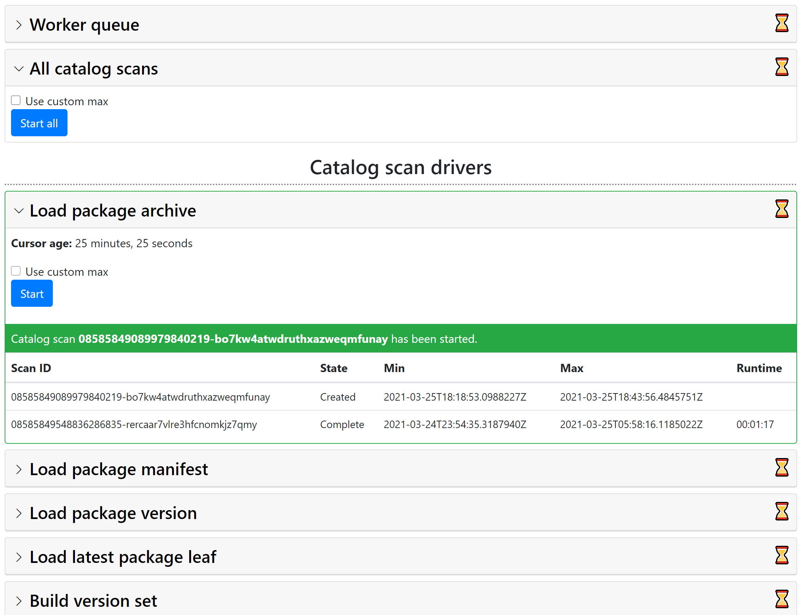

# ExplorePackages

Explore packages on a V3 NuGet package source that has a catalog (NuGet.org!) in a highly distributed manner.

Or, if you want a sales pitch:

> Process all of NuGet.org in less than an hour for less than $10.*

(*depending on what you want to know 😅)

## Running locally

To run locally, all you need is [Azure Storage Emulator](https://docs.microsoft.com/en-us/azure/storage/common/storage-use-emulator).
Note that you cannot use Azurite since the latest version of it does not support Azure Table Storage.

1. Clone the repository.
1. Open the solution in Visual Studio (ExplorePackages.sln).
1. Make sure the Azure Storage Emulator is running.
1. Press F5 to launch the website (ExplorePackages.Website). It's the default startup project.
1. Click on the "Admin" link in the navigation bar.
2. Start one of the catalog scans, e.g. Find Package Manifest.
   - When starting out, use a custom max timestamp like `2015-02-01T06:22:45.8488496Z` and click "Start Custom Scan".
   - This timestamp is the first commit to the catalog and will run quickly, only processing 20 packages.
   - Pressing "Start Full Scan" will process the entire catalog and will take a very long time locally.
3. Stop the website.
4. Start the function app (ExplorePackages.Worker).
5. Wait until the catalog scan is done.
   - This can be seen by looking at the `workerqueue` queue or by looking at the admin panel seen above.

## Deploying to Azure

If you want to deploy this to Azure:

1. [Install Pulumi and configure it for Azure](https://www.pulumi.com/docs/get-started/azure/).
1. Install my Pulumi plug-in for workaround around some problems ([context](https://github.com/joelverhagen/pulumi-knapcode#full-explanation)).
   ```
   pulumi plugin install resource knapcode v0.0.1 --server https://github.com/joelverhagen/pulumi-knapcode/releases/download/v0.0.1
   ```
1. Go to the infrastructure directory.
   ```
   cd src/ExplorePackages.Infrastructure
   ```
1. Select a stack (or make a new one). Feel free to clear out my default `AllowedUsers` config.
   ```
   pulumi stack select dev
   ```
1. Publish the worker and website.
   ```
   dotnet publish ../ExplorePackages.Worker -c Release
   dotnet publish ../ExplorePackages.Website -c Release
   ```
1. Deploy!
   ```
   pulumi up
   ```

You will need to update the configuration with your hashed tenant ID and object ID claims to gain access to the admin
panel. The "access denied" page of the admin panel will list all of your claims so you can grab the values there then
bake them into your Pulumi stack's YAML config file for subsequent deployments.

## Screenshots

### Azure Function running locally

This is what the Azure Function looks like running locally, for the Find Package Manifest driver.


### Results running locally

This is what the results look like in Azure Table Storage. Each row is a package .nuspec stored as compressed
MessagePack bytes.


### Admin panel

This is what the admin panel looks like to start catalog scans.



### Find Package File

This is the driver that reads the file list and package signature from all NuGet packages on NuGet.org and loads them
into Azure Table Storage. It took about 35 minutes to do this and costed about $3.37.

#### Azure Functions Execution Count


#### Azure Functions Execution Count


#### Deploying to Azure using Pulumi


## Architecture

The purpose of this repository is to explore the characteristics, oddities, and inconsistencies of NuGet.org's available
packages.

Fundamentally, the project uses the [NuGet.org catalog](https://docs.microsoft.com/en-us/nuget/api/catalog-resource) to
enumerate all package IDs and versions. For each ID and version, some unit of work is performed. This unit of work can
be some custom analysis that you want to do on a package. There are some helper classes to write the results out to big
CSVs for importing into Kusto or the like but in general, you can do whatever you want per package.

The custom logic to run on a per-package (or per catalog leaf/page) is referred to as a "driver".

The enumeration of the catalog is called a "catalog scan". The catalog scan is within a specified time range in the
catalog, with respect to the catalog commit timestamp. A catalog scan finds all catalog leaves in the provided min and
max commit timestamp and then executes a "driver" for each package ID and version found.

All work is executed in the context of an Azure Function that reads a single worker queue (Azure Storage Queue).

The general flow of a catalog scan is:

1. Download the catalog index.
1. Find all catalog pages in the time range.
1. For each page, enumerate all leaf items per page in the time range.
1. For each leaf item, write the ID and version to Azure Table Storage to find the latest leaf.
1. After all leaf items have been written to Table Storage, enqueue one message per row.
1. For each queue message, execute the driver.

Note there is an option to disable step 4 and run the driver for every single catalog leaf item. Depending on the logic
of the driver, this may yield duplicated effort and is often not desired.

The implementation is geared towards Azure Functions Consumption Plan for compute (cheap) and Azure Storage for
persistence (cheap).

## Projects

Here's a high-level description of main projects in this repository:

- [`ExplorePackages.Worker`](src/ExplorePackages.Worker) - the Azure Function itself, a thin adapter between core logic and Azure Functions
- [`ExplorePackages.Website`](src/ExplorePackages.Website) - a website for checking [consistency](#consistency) and an admin panel for starting scans
- [`ExplorePackages.Worker.Logic`](src/ExplorePackages.Worker.Logic) - all of the catalog scan and driver logic, this is the most interesting project
- [`ExplorePackages.Logic`](src/ExplorePackages.Logic) - contains more generic logic related to NuGet.org protocol and is not directly related to distributed processing

Other projects are:

- [`ExplorePackages.Infrastructure`](src/ExplorePackages.Infrastructure) - Pulumi infrastructure-as-code for deploying to Azure
- [`ExplorePackages.SourceGenerator`](src/ExplorePackages.SourceGenerator) - AOT source generation logic for reading and writing CSVs
- [`ExplorePackages.Tool`](src/ExplorePackages.Tool) - a command-line app used for pretty much just prototyping code

## Notable classes

The main drivers for learning about packages are:

- [`FindPackageAssembly`](src/ExplorePackages.Worker.Logic/CatalogScan/Drivers/FindPackageAssembly/FindPackageAssemblyDriver.cs) - find stuff like public key tokens in assemblies using `System.Reflection.Metadata`
- [`FindPackageAsset`](src/ExplorePackages.Worker.Logic/CatalogScan/Drivers/FindPackageAsset/FindPackageAssetDriver.cs) - find assets recognized by NuGet restore
- [`FindPackageSignature`](src/ExplorePackages.Worker.Logic/CatalogScan/Drivers/FindPackageSignature/FindPackageSignatureDriver.cs) - parse the NuGet package signature

Several other supporting drivers exist:

- [`FindCatalogLeafItem`](src/ExplorePackages.Worker.Logic/CatalogScan/Drivers/FindCatalogLeafItem/FindCatalogLeafItemDriver.cs) - write all catalog leaf items to big CSVs for analysis
- [`FindLatestPackageLeaf`](src/ExplorePackages.Worker.Logic/CatalogScan/Drivers/FindLatestPackageLeaf) - write the latest catalog leaf to Table Storage
- [`FindPackageFile`](src/ExplorePackages.Worker.Logic/CatalogScan/Drivers/FindPackageFile/FindPackageFileDriver.cs) - fetch information from the .nupkg and put it in Table Storage
- [`FindPackageManifest`](src/ExplorePackages.Worker.Logic/CatalogScan/Drivers/FindPackageManifest/FindPackageManifestDriver.cs) - fetch the .nuspec and put it in Table Storage
- [`LatestLeaf`](src/ExplorePackages.Worker.Logic/CatalogScan/LatestLeaf/FindLatestLeafDriver.cs) - infrastructure to find the latest leaf per package ID and version

Several message processes exist for other purposes:

- [`DownloadsToCsv`](src/ExplorePackages.Worker.Logic/MessageProcessors/DownloadsToCsv/DownloadsToCsvUpdater.cs) - read `downloads.v1.json` and write it to CSV
- [`OwnersToCsv`](src/ExplorePackages.Worker.Logic/MessageProcessors/OwnersToCsv/OwnersToCsvUpdater.cs) - read `owners.v2.json` and write it to CSV
- [`RunRealRestore`](src/ExplorePackages.Worker.Logic/MessageProcessors/RunRealRestore/RunRealRestoreCompactProcessor.cs) - run `dotnet restore` to test package compatibility

Finally, some interesting generic services were built to enable this analysis:

- [`AppendResultStorageService`](src/ExplorePackages.Worker.Logic/AppendResults/AppendResultStorageService.cs) - Azure Function result aggregation using Tables or append blobs
- [`AutoRenewingStorageLeaseService`](src/ExplorePackages.Logic/Leasing/AutoRenewingStorageLeaseService.cs) - an `IAsyncDisposable` that keeps a global lease renewed
- [`CsvRecordGenerator`](src/ExplorePackages.SourceGenerator/CsvRecordGenerator.cs) - AOT CSV reading and writing for a C# record/POCO
- [`TableEntitySizeCalculator`](src/ExplorePackages.Logic/Storage/TableEntitySizeCalculator.cs) - calculate exact size in bytes for a Table Storage entity
- [`TablePrefixScanner`](src/ExplorePackages.Logic/TablePrefixScan/TablePrefixScanner.cs) - run a distributed scan of a big Azure Storage Table, faster than serial scans ([blog](https://www.joelverhagen.com/blog/2020/12/distributed-scan-of-azure-tables))
- [`TempStreamService`](src/ExplorePackages.Logic/TempStream/TempStreamService.cs) - buffer to local storage (memory or disk), great for Azure Functions Consumption Plan
- [`WideEntityService`](src/ExplorePackages.Logic/WideEntities/WideEntityService.cs) - Blob Storage-like semantics with Azure Table Storage, enables batch operations

## Blog posts

I've written several blog posts based on findings in this project:

- [Disk write performance on Azure Functions](https://www.joelverhagen.com/blog/2021/02/azure-function-disk-performance) - use the Azure File Share efficiently in Consumption plan
  - Recommendations are implemented in [`TempStreamWriter.cs`](src/ExplorePackages.Logic/TempStream/TempStreamWriter.cs).
- [How to run a distributed scan of Azure Table Storage](https://www.joelverhagen.com/blog/2020/12/distributed-scan-of-azure-tables) - 10 minute Azure Functions limit and big Table Storage
  - This trick is implemented in [`TablePrefixScan`](src/ExplorePackages.Logic/TablePrefixScan).
- [The fastest CSV parser in .NET](https://www.joelverhagen.com/blog/2020/12/fastest-net-csv-parsers) - comparing the performance of .NET CSV parsers on NuGet.org
  - I used one of the initial fastest implementations in [`NRecoCsvReader`](src/ExplorePackages.Worker.Logic/AppendResults/NRecoCsvReader.cs).
- [The fastest way to dynamically activate objects in .NET](https://www.joelverhagen.com/blog/2020/11/dynamically-activate-objects-net) - ILEmit vs. `new T()` vs. `Activator`, etc.
  - I used the fastest approach allowing generics in [`NRecoCsvReader`](src/ExplorePackages.Worker.Logic/AppendResults/NRecoCsvReader.cs), which is tied between `new T()` and `Activator`. I didn't use ILEmit since the overhead was too high for Azure Functions.

## Performance and cost

*As of February 2021*

Tested timestamp range:
- Min: `2015-02-01T06:22:45.8488496Z`
- Max: `2021-02-05T15:55:33.3608941Z`

Results:
- `FindPackageFile`
  - Runtime: 37 minutes, 19 seconds
  - Total cost: $3.37

<details>
<summary>Detailed cost</summary>

- Azure Functions cost - $2.77
  - bandwidth / data transfer out - $1.62
  - functions / execution time - $1.13
  - functions / total executions - $0.01
- Azure Storage cost - $0.60
  - storage / tables / scan operations - $0.26
  - storage / tables / batch write operations - $0.15
  - storage / queues v2 / lrs class 1 operations - $0.13
  - storage / tiered block blob / all other operations - $0.01
  - storage / files / protocol operations - $0.01

</details>

- `FindPackageSignature`
  - Runtime: 1 hour, 11 minutes, 29 seconds
  - Total cost: $6.30

<details>
<summary>Detailed cost</summary>

- Azure Functions cost - $4.97
  - functions / execution time - $4.14
  - bandwidth / data transfer out - $0.81
  - functions / total executions - $0.02
- Azure Storage cost - $1.33
  - storage / tables / batch write operations - $0.36
  - storage / tables / scan operations - $0.26
  - storage / queues v2 / lrs class 1 operations - $0.14
  - storage / tables / delete operations - $0.13
  - storage / tables / write operations - $0.13
  - storage / tiered block blob / all other operations - $0.05
  - storage / files / protocol operations - $0.04
  - storage / queues v2 / class 2 operations - $0.04
  - storage / files / lrs write operations - $0.02
  - storage / tables / read operations - $0.01
  - storage / tables / lrs class 1 additional io - $0.01

</details>

- `FindPackageAsset`
  - Runtime: 41 minutes, 34 seconds
  - Total cost: $5.61

<details>
<summary>Detailed cost</summary>

- Azure Functions cost - $4.11
  - functions / execution time - $2.52
  - bandwidth / data transfer out - $1.57
  - functions / total executions - $0.02
- Azure Storage cost - $1.50
  - storage / tables / batch write operations - $0.35
  - storage / tables / scan operations - $0.25
  - storage / queues v2 / lrs class 1 operations - $0.13
  - storage / tables / delete operations - $0.14
  - storage / tables / write operations - $0.14
  - storage / files / lrs write operations - $0.24
  - storage / files / protocol operations - $0.20
  - storage / tiered block blob / all other operations - $0.01
  - storage / queues v2 / class 2 operations - $0.02
  - storage / tables / read operations - $0.01
  - storage / tables / lrs class 1 additional io - $0.01

</details>

- `FindPackageAssembly`
  - Runtime: 1 hour, 33 minutes, 25 seconds
  - Total cost: $6.37

<details>
<summary>Detailed cost</summary>

- Azure Functions cost - $6.37
  - functions / execution time - $0.63
  - bandwidth / data transfer out - $0.87
  - functions / total executions - $0.04
- Azure Storage cost - $4.74
  - storage / queues v2 / lrs class 1 operations - $3.08
  - storage / files / lrs write operations - $0.48
  - storage / tables / batch write operations - $0.35
  - storage / tables / scan operations - $0.24
  - storage / tiered block blob / all other operations - $0.14
  - storage / tables / delete operations - $0.13
  - storage / tables / write operations - $0.13
  - storage / tables / read operations - $0.13
  - storage / files / protocol operations - $0.01
  - storage / files / read operations - $0.01
  - storage / queues v2 / class 2 operations - $0.01
  - storage / tables / lrs class 1 additional io - $0.01

</details>

## Consistency

I've also used this framework to look for inconsistencies in the V2 and V3 endpoints. To make this easier, I made a
little website to see if your package is fully propagated on NuGet.org (that is, the indexing is complete).

https://explorepackages.azurewebsites.net/

