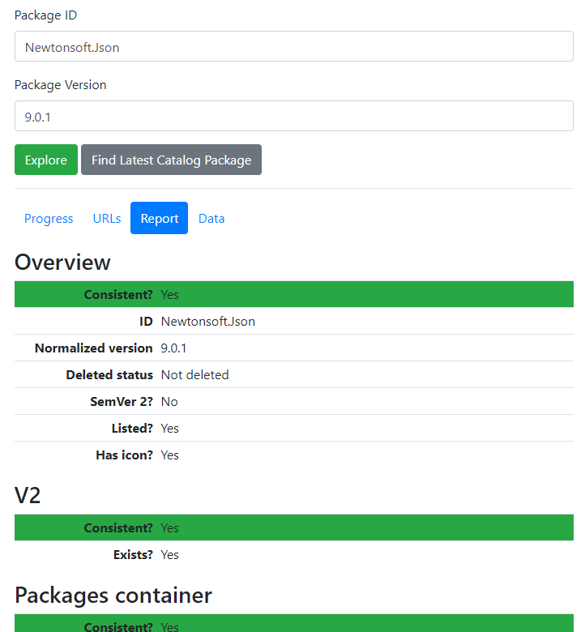

# Consistency

I've also used this framework to look for inconsistencies in the V2 and V3 endpoints. To make this easier, I made a
little website to see if your package is fully propagated on NuGet.org (that is, the indexing is complete).

https://explorepackages.azurewebsites.net/

This is a website that polls the various NuGet.org API endpoints for data specific to a provide package (ID + version).
A report is given back saying whether the data across the endpoints is self-consistent and in the expected form.

