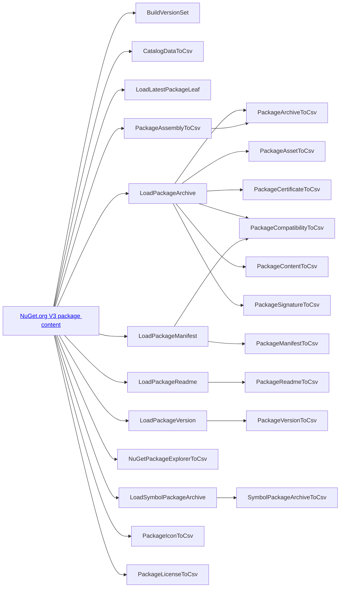

# NuGet Insights catalog scan drivers

For general information on what a catalog scan is or what a driver is, see the root [README](../../README.md#architecture).

For information on how to add a new driver, see [**Adding a new driver**](../new-driver.md).

## Drivers

The following drivers are currently implemented in NuGet Insights.

| Driver name                                               | Description                                                           |
| --------------------------------------------------------- | --------------------------------------------------------------------- |
| [BuildVersionSet](BuildVersionSet.md)                     | Build a lookup dictionary of all IDs and version for in-memory usage  |
| [CatalogDataToCsv](CatalogDataToCsv.md)                   | Write catalog data directly to CSV                                    |
| [LoadLatestPackageLeaf](LoadLatestPackageLeaf.md)         | Test the "load latest" distributed algorithm used in several places   |
| [LoadPackageArchive](LoadPackageArchive.md)               | Load package .nupkg metadata and package signature into table storage |
| [LoadPackageManifest](LoadPackageManifest.md)             | Load package .nuspec into table storage                               |
| [LoadPackageReadme](LoadPackageReadme.md)                 | Load package README Markdown into table storage                       |
| [LoadPackageVersion](LoadPackageVersion.md)               | Load full version list per package ID into table storage              |
| [LoadSymbolPackageArchive](LoadSymbolPackageArchive.md)   | Load symbol package .snupkg metadata into table storage               |
| [NuGetPackageExplorerToCsv](NuGetPackageExplorerToCsv.md) | Write NuGet Package Explorer results to CSV                           |
| [PackageArchiveToCsv](PackageArchiveToCsv.md)             | Write package ZIP metadata to CSV                                     |
| [PackageAssemblyToCsv](PackageAssemblyToCsv.md)           | Write .NET assembly information metadata to CSV                       |
| [PackageAssetToCsv](PackageAssetToCsv.md)                 | Write NuGet client package asset results to CSV                       |
| [PackageCertificateToCsv](PackageCertificateToCsv.md)     | Write certificate metadata and package relationships to CSV           |
| [PackageCompatibilityToCsv](PackageCompatibilityToCsv.md) | Write package framework compatibility to CSV                          |
| [PackageContentToCsv](PackageContentToCsv.md)             | Write full package content to CSV from specific interesting files     |
| [PackageIconToCsv](PackageIconToCsv.md)                   | Write package icon metadata to CSV                                    |
| [PackageLicenseToCsv](PackageLicenseToCsv.md)             | Write package license content and metadata to CSV                     |
| [PackageManifestToCsv](PackageManifestToCsv.md)           | Write package .nuspec data to CSV                                     |
| [PackageReadmeToCsv](PackageReadmeToCsv.md)               | Write full package README content to CSV                              |
| [PackageSignatureToCsv](PackageSignatureToCsv.md)         | Write summarized package signature metadata to CSV                    |
| [PackageVersionToCsv](PackageVersionToCsv.md)             | Write latest version state (and related inputs) to CSV                |
| [SymbolPackageArchiveToCsv](SymbolPackageArchiveToCsv.md) | Write symbol package ZIP metadata to ZIP                              |

## Terminology & concepts

In these documents, the following properties are documented for each driver:

**`CatalogScanDriverType` enum value**: there is one of these enum values per catalog scan driver. This allows easy `switch` code across the drivers. 

**Driver implementation**: a link to the core driver implementation. Each driver has a subdirectory so many of the related implementation details can be found in the same directory as the driver.

**Processing mode**: some drivers process as the leaf level and others process as the catalog page level. Others are tolerant (or even require) the duplicate catalog leaves that may relate to a single package whereas others perform better without duplicates. This processing mode describes that variation across all of the drivers.

**Cursor dependencies**: these are the [catalog cursors](https://learn.microsoft.com/en-us/nuget/api/catalog-resource#cursor) that the driver depends on. A cursor dependency is a cursor whose value will never be surpassed by the driver's own cursor. Some dependencies are other drivers and some dependencies are cursors on NuGet.org. A catalog cursor is a critical way to enforce dependencies between data produced by one driver and used by another driver.

**Components using driver output**: these are parts of NuGet Insights that use the output of the driver. Part of this would be the inverse of *Cursor dependencies*, i.e. cursor dependents, but other non-driver parts of the NuGet Insights [workflow](../../README.md#workflow) may use driver output as well.

**Persistent storage config**: these are config keys in [`NuGetInsightsSettings`](../../src/Logic/NuGetInsightsSettings.cs) or [`NuGetInsightsWorkerSettings`](../../src/Worker.Logic/NuGetInsightsWorkerSettings.cs) that refer to a name or name prefix of an Azure Blob Storage container, Azure Queue Storage queue, or Azure Table Storage table. These names refer to permanent storage containers that will be added to as more catalog scans are executed by the driver. They are used as output locations for the driver and may be used by other NuGet Insights components.

**Temporary storage config**: same as the previous point but they are deleted at the end of the catalog scan. There are essentially implementation details of the driver and shouldn't be used by other components.

**Output CSV tables**: zero or more specific CSV tables that are produced by the driver. Not all drivers create CSV tables.

## Dependency graph

The following flowchart shows the dependencies between all of the drivers. These relationships are described in each driver document listed above. The arrow direction goes from dependency to dependent to emphasize data flow.

